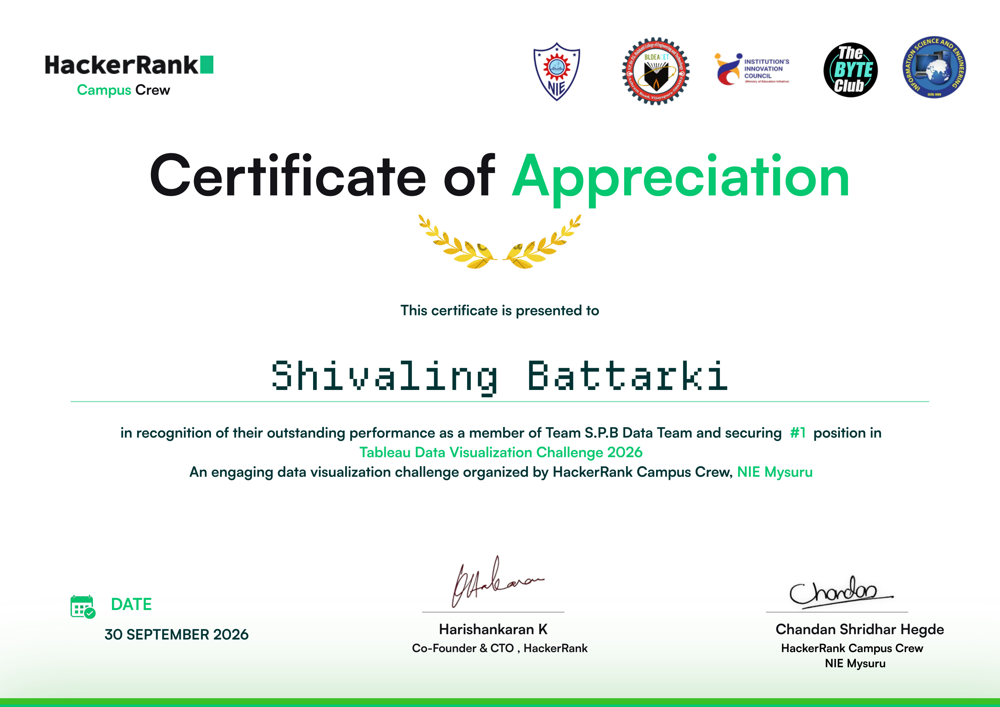
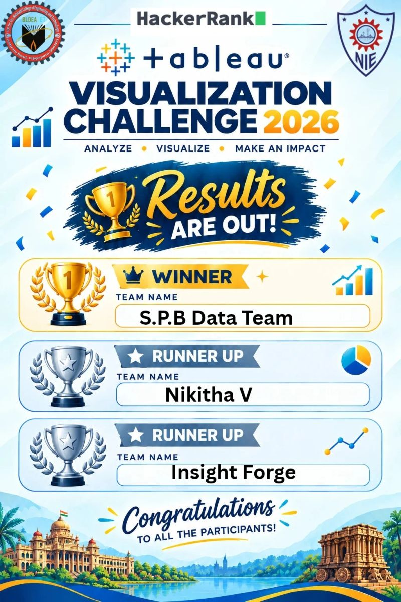
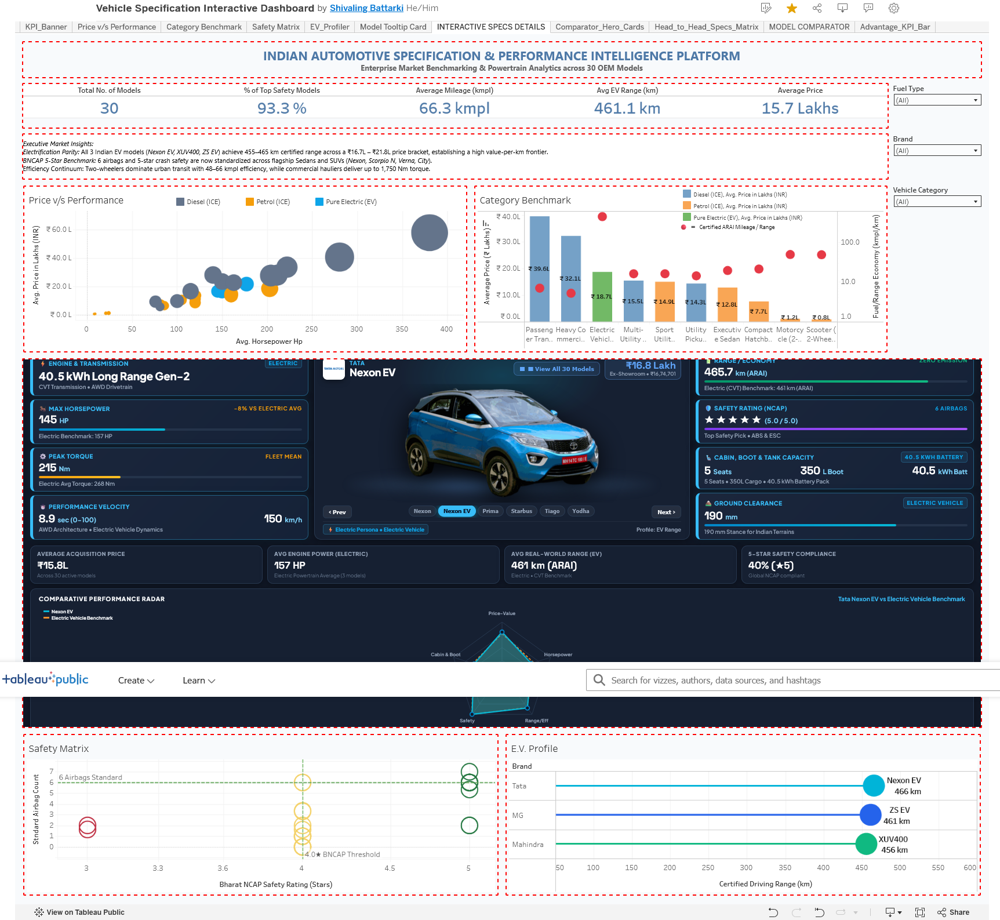
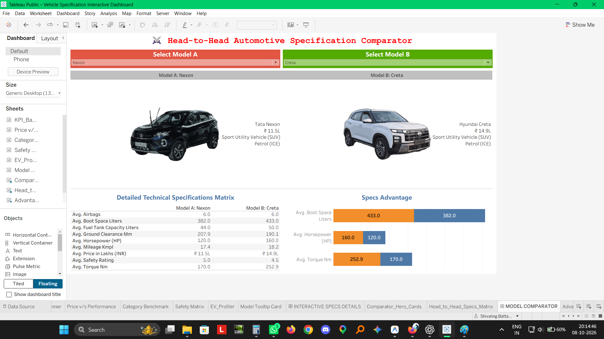
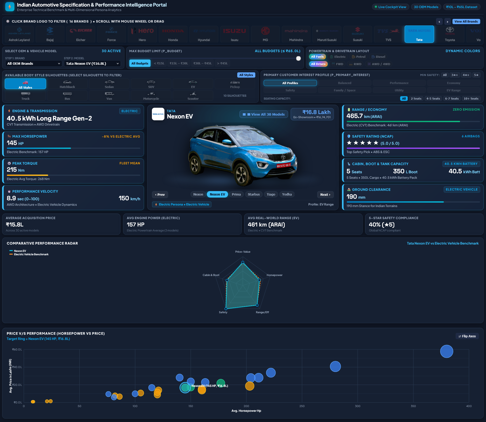

# 🚗 Indian Automotive Specification & Performance Intelligence Platform

> 🏆 **1st Place Winner** — **Tableau & Data Visualization Challenge 2026**  
> Organized by **The National Institute of Engineering (NIE), Mysuru** & **HackerRank Campus Crew** on [Unstop](https://unstop.com/competitions/tableau-data-visualization-challenge-2026-national-institute-of-engineering-nie-mysuru-1753895)  
> Built by **S.P.B Data Team**

[](https://public.tableau.com/app/profile/shivaling.battarki/viz/VehicleSpecificationInteractiveDashboard/INTERACTIVESPECSDETAILS?publish=yes)
[](https://hazardous9hub.github.io/Indian-Automotive-Specification-Intelligence-Portal/)
[](https://lnkd.in/p/gVCpZ_Jw)
[](data/vehicle_specification_dataset_10000_rows.csv)
[](LICENSE)

---

## ⚡ At a Glance

Most automotive platforms fall into two extremes: consumer portals show specs in isolation, while corporate BI dashboards show abstract dots. 

We bridged both worlds into a **synchronized two-layer intelligence platform**:

| Layer | Technology | Role & Key Highlights |
| :--- | :--- | :--- |
| **Layer 1: Macro BI Engine** | **Tableau Public** | Market price-to-performance curves, category averages, safety compliance, and direct head-to-head model comparisons across 10,000 records. |
| **Layer 2: Digital Showroom** | **Vanilla HTML5 & Canvas 2D** | Real-time vehicle cutouts and an interactive 6-axis performance radar chart embedded directly inside Tableau via URL parameter actions. |

---

## 🔗 Quick Access Links

- 📊 **Tableau Public Live Dashboard**: [Launch Interactive Workbook](https://public.tableau.com/app/profile/shivaling.battarki/viz/VehicleSpecificationInteractiveDashboard/INTERACTIVESPECSDETAILS?publish=yes)
- 🌐 **Live Web Intelligence Portal**: [Open GitHub Pages Showroom](https://hazardous9hub.github.io/Indian-Automotive-Specification-Intelligence-Portal/)
- 💼 **LinkedIn Project Breakdown**: [Read the Full Breakdown on LinkedIn](https://lnkd.in/p/gVCpZ_Jw)
- 💻 **GitHub Repository**: [Hazardous9hub/Indian-Automotive-Specification-Intelligence-Portal](https://github.com/Hazardous9hub/Indian-Automotive-Specification-Intelligence-Portal)

---

## 📸 Visual Showcase & Evidence

### 1. Winner Certificate & Competition Announcement
| Winner Certificate of Appreciation | Official Competition Poster |
| :---: | :---: |
|  |  |
| *Official 1st Place Certificate from HackerRank & NIE Mysuru* | *Tableau Challenge Announcement Poster* |

### 2. Tableau Dashboards
| Dashboard 1: Master Specification Cockpit | Dashboard 2: Head-to-Head Comparator |
| :---: | :---: |
|  |  |
| *Price vs. HP scatter, category benchmark dual-axis & EV profiler* | *Side-by-side comparison with custom vehicle shape cards & delta bars* |

### 3. Interactive Web Portal
| Embedded Web Intelligence Portal |
| :---: |
|  |
| *HTML5 Canvas 2D 6-axis performance radar chart and vehicle showcase pedestal* |

*(Note: `06_web_portal_vehicle_profile.png` is pending capture and will be added in a future update).*

---

## 🎯 Key Questions We Answer

- 🏎️ **Price-Performance Frontier**: Which segments offer the highest horsepower-per-lakh ratio? *(e.g. ₹15L–₹22L mid-SUVs deliver 8.5–10.9 HP/Lakh)*.
- 🛡️ **Safety Democratization**: How do Bharat NCAP and Global NCAP star ratings and airbag distributions scale across budget tiers?
- ⚡ **EV vs. ICE Trade-offs**: How do high-voltage battery pack capacities (kWh) relate to certified ARAI range compared to internal combustion efficiency?
- ⚖️ **Direct Head-to-Head Comparison**: How do two competing models differ across dimensions, torque, power, ground clearance, and boot space?

---

## 🏛️ Platform Architecture

```
┌─────────────────────────────────────────────────────────────┐
│                 LAYER 1: TABLEAU BI ENGINE                  │
│   • 10,000 Calibrated Records across 30 Benchmark Models    │
│   • Price vs. Horsepower Scatter (Color=Fuel, Size=Torque)  │
│   • Category Benchmark (Bars=Price, Dots=Mileage/Range)     │
│   • Standalone Head-to-Head Model Comparator (A vs B)       │
└──────────────────────────────┬──────────────────────────────┘
                               │
                      URL Parameter Action
      (?model=<Model>&brand=<Brand>&fuel=<Fuel>&category=<Cat>)
                               │
┌──────────────────────────────▼──────────────────────────────┐
│            LAYER 2: EMBEDDED WEB SHOWROOM PORTAL            │
│   • Client-Side Vanilla HTML5 + CSS Grid + Canvas 2D        │
│   • 6-Axis Normalized Performance Telemetry Radar           │
│   • Dynamic Vehicle Stage & Spec Conflict Engine            │
└─────────────────────────────────────────────────────────────┘
```

Selecting any vehicle in Tableau automatically passes URL parameters to the embedded web frame, updating the 6-axis radar and specs in real time without refreshing the page.

---

## 📊 Tableau Dashboards Walkthrough

The workbook (`tableau/Vehicle_Specification_Master_Dashboard.twbx`) contains two production dashboards:

### Dashboard 1: Master Specification Cockpit (`INTERACTIVE SPECS DETAILS`)
- **Executive KPIs**: Active fleet count (30 models across 16 OEMs), segment median price, fleet average horsepower, and 5-star NCAP safety rate.
- **Price vs. Performance (Scatter Plot)**: Maps Horsepower (X: 0–400 HP) against Ex-Showroom Price (Y: ₹0–₹65 Lakhs). Sized by Peak Torque (Nm) and colored by Powertrain (🟢 EV, 🟡 Petrol, 🔵 Diesel).
- **Category Benchmark (Dual-Axis Chart)**: Columns group categories (Hatchback, Sedan, SUV, Commercial, 2-Wheeler); vertical bars show Average Price (Lakhs INR); overlaid red dots show Average Mileage (km/l) or EV Range (km).
- **Safety Matrix & EV Profiler**: Cross-tabulates NCAP ratings vs. airbags, and correlates battery pack kWh directly with certified ARAI range.
- **Embedded Web Container**: Houses the live digital showroom inside the Tableau dashboard canvas.

### Dashboard 2: Head-to-Head Model Comparator (`MODEL COMPARATOR`)
- **Dual Dropdown Controls**: Parameter selectors `[Select Model A]` and `[Select Model B]`.
- **Custom Shape Cards**: Uses the custom `Indian_Vehicles` shape palette to render vehicle silhouettes alongside price, category, and fuel badges.
- **Specification Matrix**: Side-by-side tabular comparison across 8 core metrics.
- **Performance Delta Bars**: Diverging horizontal bars showing lead margins in Power (HP), Torque (Nm), and Cargo volume (Liters).

---

## 🌐 Interactive Web Portal Walkthrough

The web portal (`index.html`) is a standalone single-page application hosted on GitHub Pages:
- **6-Axis Performance Radar**: Rendered on HTML5 Canvas 2D, normalizing Power, Torque, Range/Mileage, Safety, Boot Space, and Ground Clearance against category averages.
- **Pedestal Showcase**: GSAP-driven transitions displaying transparent vehicle cutouts scaled to proportionate dimensions.
- **Conflict Diagnostics**: Automatically detects physical mismatches (e.g., Electric silhouette with Petrol fuel) with an auto-resolve mechanism.
- **URL Parameter Router**: Reads query parameters (`?brand=...&model=...`) to focus any model instantly.

---

## 🛠️ Development Workflow & Authentic Attribution

We maintain complete transparency regarding tool usage and development:

- **Tableau Dashboards**: **100% conceived, designed, calculated, and built by the S.P.B Data Team**. All worksheets, calculated fields (`HP_per_Lakh_INR`, `Filter_Selected_A_or_B`, `Safety_Stars_Display`), parameter architectures, dual-axis encodings, and layouts were built by our team.
- **Interactive Web Portal**: Developed with technical assistance from **Google's Antigravity IDE**, which assisted in writing and optimizing the vanilla HTML5, CSS Grid, Canvas 2D telemetry, and URL parameter parser logic under our direction, review, and integration.
- **Integration**: Joined via Tableau's native Web Page Dashboard Object and URL Actions.

---

## 🧪 Data Foundation & Methodology

- **10,000 Calibrated Records**: Generated via Python (`scripts/calibrate_entire_ecosystem.py`) with controlled Gaussian variance (±3.5%) around verified real-world baselines.
- **30 Benchmark Models across 16 OEMs**: Covers Hatchbacks, Sedans, Compact SUVs, Mid SUVs, Trucks, Buses, and 2-Wheelers (Tata, Mahindra, Maruti Suzuki, Hyundai, Toyota, Volvo, Ashok Leyland, Hero, TVS, etc.).
- **Grounded in Indian Realities**: Anchored in certified ARAI fuel efficiency/range, realistic ground clearance (162–240 mm), and Bharat/Global NCAP safety ratings.

---

## 📁 Repository Structure

```
Indian-Automotive-Specification-Intelligence-Portal/
├── assets/                  # 30 vehicle cutouts, 16 SVG logos, silhouettes, GSAP
├── data/                    # 10k calibrated records (CSV/Excel) & baseline profiles
├── docs/                    # Documentation, screenshots & technical dossier
│   └── screenshots/         # 5 verified project screenshots
├── scripts/                 # Data calibration, image optimization & sync scripts
├── tableau/                 # Packaged Tableau workbook (.twbx) & raw XML (.twb)
├── index.html               # Standalone web portal & embedded showroom
├── LICENSE                  # MIT License
└── README.md                # Repository documentation
```

---

## 🚀 Quick Start (Run Locally in 60 Seconds)

### Run the Web Portal
No build tools, npm, or database required:
```bash
# 1. Clone the repository
git clone https://github.com/Hazardous9hub/Indian-Automotive-Specification-Intelligence-Portal.git
cd Indian-Automotive-Specification-Intelligence-Portal

# 2. Start a local HTTP server
python -m http.server 8000
```
Open `http://localhost:8000/index.html` in your browser.  
Test parameter routing: `http://localhost:8000/index.html?brand=Tata&model=Nexon%20EV&fuel=Electric`

### Open the Tableau Workbook
1. Open `tableau/Vehicle_Specification_Master_Dashboard.twbx` in **Tableau Desktop** or **Tableau Public**.
2. *(Optional)* To view custom vehicle shapes locally, place vehicle PNGs in:  
   `Documents\My Tableau Repository\Shapes\Indian_Vehicles\`.

---

## ⚠️ Limitations & Notes

- **Calibrated Dataset**: The 10,000 records represent calibrated competition data with ±3.5% Gaussian variance around genuine OEM baselines—not certified manufacturer build sheets.
- **Web Object Network Dependency**: When viewing inside Tableau, the embedded showroom requires an active internet connection to load GitHub Pages.

---

## 👥 S.P.B Data Team & Acknowledgements

### Project Team:
| Member | Profiles | Contact |
| :--- | :--- | :--- |
| **Shivaling Battarki** | [@Hazardous9hub](https://github.com/Hazardous9hub) · [LinkedIn](https://www.linkedin.com/in/shivaling-93000/) | `shivalingb09@gmail.com` |
| **Pragatheswaran M** | [@Pragatheswaran-M](https://github.com/Pragatheswaran-M) · [LinkedIn](https://www.linkedin.com/in/pragatheswaranm/) | `pragathes224@gmail.com` |
| **Basavaraj Kale** | [@basawaraj849](https://github.com/basawaraj849) · [LinkedIn](https://www.linkedin.com/in/basawarajkale/) | `kale.sbasawaraj@gmail.com` |

### Acknowledgements:
Organized by **The National Institute of Engineering (NIE), Mysuru** and **HackerRank Campus Crew** via **Unstop** (Tableau & Data Visualization Challenge 2026). Special thanks to **Chandan Shridhar Hegde**, **Dr. Vanamala C K**, and the evaluation committee.
